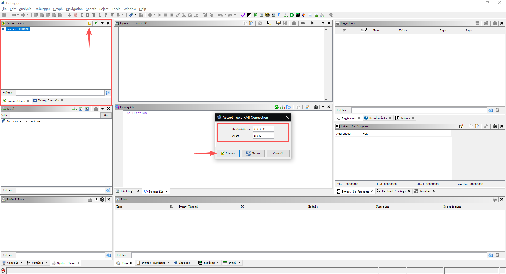
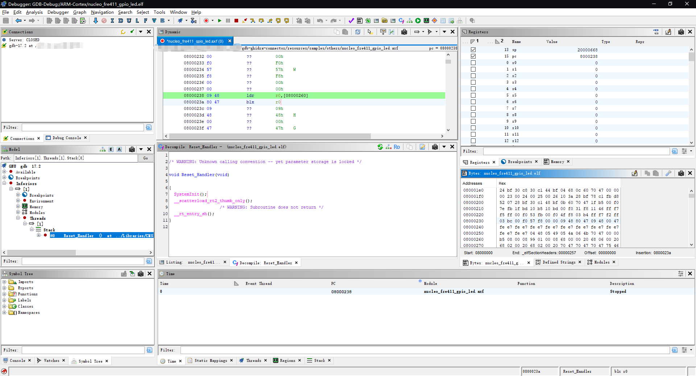

# gdb-ghidra-connector
后端 Qemu/Openocd 通过 gdb 连接 Ghidra Debugger RMI 实现前端回显，方便动态调试分析。  
The backend Qemu/Openocd connects to the Ghidra Debugger RMI via gdb to enable frontend echo, facilitating dynamic debugging and analysis.  

> 依赖：qemu-system/openocd/gdb-multiarch/ghidra>12.0  
> 注意：暂不支持调试bin文件，本项目主要用来本人实验研究使用，功能有限，可以自行研究扩展；有源码和板子，建议使用 Keil uVision5 / STMCubeIDE等工具调试更简单。

## gdb-multiarch Download

```bash
sudo apt update
sudo apt install gdb-multiarch
```

## Openocd / Qemu Download
`openocd` [GitHub Download](https://github.com/xpack-dev-tools/openocd-xpack/releases) | `Qemu` [Download from Official](https://www.qemu.org/download/#linux)

## Ghidra Environments
安装 Ghidra-Debugger 的依赖
```bash
# using virtual environments
python -m venv .venv
source .venv/bin/activate

# requirements
pip3 install psutil protobuf

# ghidra-debugger
pip3 install --no-index \
    -f <GHIDRA_HOME>/Ghidra/Debug/Debugger-rmi-trace/pypkg/dist \
    -f <GHIDRA_HOME>/Ghidra/Debug/Debugger-agent-gdb/pypkg/dist \
    ghidratrace ghidragdb
```
### Ghidra Debugger Config
在 Ghidra 打开 Debugger 工具 -> Connections 窗口 -> 点击 "Accept a single inbound TCP connection"（或保持 Trace RMI Server 常驻监听）  

> Note:   
win11-wsl2-mirror 模式下监听网络配置 --> 127.0.0.1:port  
win10-wsl 模式下监听网络配置 --> 0.0.0.0:port  
>  

[](./resources/images/Ghidra-Debbuger-Connections.png)  

## Quick Start

Demo 固件为 `./resources/samples/others/nucleo_fre411_gpio_led.axf`，固件内容为两个LED灯交叉闪烁（LL_GPIO_PIN_5 || LL_GPIO_PIN_6）；脚本使用例程详见 [后端使用例程 `run_backend_led.sh`](./resources/docs/linux-run-demo/run_backend_led.sh) | [前端连接例程 `run_gdb_led.sh`](./resources/docs/linux-run-demo/run_gdb_led.sh)。  

下面演示，后端动态执行工具以 Qemu 为实例，前端以 Ghidra 为例。  
STEP1: 先启动后端（Qemu为例）  
```bash
cd /path/to/gdb-ghidra-connector
./run_backend_led.sh -b qemu
# ctrl+a then x to terminate qemu
# Note: When using OpenOCD within WSL, ensure that USB port mapping is implemented.
```
STEP2: 启动 Ghidra 前端：打开 Ghidra Debugger 的端口监听，配置网络号以及监听端口号，详见 [Ghidra Debugger Config](#ghidra-debugger-config)  
STEP3: 启动 gdb 连接后端以及 ghidra 前端
```bash
cd /path/to/gdb-ghidra-connector
# 如果pip未安装 ghidra debugger，请注意配置 Ghidra Path
./run_gdb_led.sh -m ghidra -p 1234 -g 18932
```
STEP4: 回到 Ghidra Debugger 观察回显，开始调试  
[](./resources/images/Ghidra-Debbuger-Connections-res.png)

## Shell Scripts Introduction
本项目例程后端脚本仅支持 Qemu（[`backend_qemu.sh`](./src/backend_qemu.sh)） 和 Openocd（[`backend_openocd.sh`](./src/backend_openocd.sh)），用于实验室研究，实际上，此后端可以自由编写，仅开放端口供 gdb 连接即可。  

[`gdb_connect.sh`](./src/gdb_connect.sh) 是不接入 Ghidra 的纯 GDB 前端，建议先用它验证后端连接、断点和复位，再运行 [`gdb_ghidra_connect.sh`](./src/gdb_ghidra_connect.sh)。两个脚本都提供 `target-reset` 命令：QEMU 默认发送 `monitor system_reset`，OpenOCD 默认发送 `monitor reset halt`，也可用 `-R "monitor ..."` 覆盖；加 `-r` 可在连接后立即复位。

### 断点为什么会失败

裸机程序通常在只读 Flash（例如 ARM 的 `0x08000000`）中执行，软件断点需要把 trap 指令写回目标内存，因此可能收到 `Cannot insert breakpoint` 或 `Cannot access memory`。此外，`.bin` 文件没有符号表，`break main` 之类的符号断点无法解析。请使用同一固件的 `.elf/.axf` 作为 `-f`，并按后端选择断点类型：

```bash
# 让 GDB 根据目标 memory-map 自动选择（默认）
./src/gdb_ghidra_connect.sh -a arm -f firmware.elf -p 1234 -b '*0x08000100'

# Flash/硬件 stub 不支持软件断点时，强制使用硬件断点
./src/gdb_ghidra_connect.sh -a arm -f firmware.elf -p 3333 \
    -T extended-remote -k hardware -b '*0x08000100'
```

Ghidra 的“Set Breakpoint”默认对应 GDB 的软件断点；如果目标只允许硬件断点，应在 Ghidra 中选择硬件断点动作，或先在 GDB 中用 `hbreak *地址` 验证。硬件断点数量受 Cortex-M 调试器限制，达到上限后需要删除/禁用旧断点。

复位不是 GDB Remote Serial Protocol 的统一命令，必须由后端 monitor 实现。复位后若断点消失，重新执行 `break`/`hbreak`，或启动脚本时使用 `-r`（脚本会先复位，再设置 `-b` 指定的断点）。

gdb-ghidra的连接 [`gdb_ghidra_connect.sh`](./src/gdb_ghidra_connect.sh) 主要是在 gdb 内安装 ghidragdb 以及 ghidratrace 两个py库，本项目选择将二者安装到 virtualenv 中并通过临时 export site-packages 到 PYTHONPATH 的策略使得 gdb 可以调用 venv 内安装的py库程序。

gdb-multiarch 内和 ghidra 的连接主要通过下面方式连接：  
```bash
# gdb 内调试
# ---- 接入 Ghidra Debugger (Trace RMI) ----"
python import ghidragdb
echo "[gdbinit] 已加载 ghidragdb 插件\\n"
ghidra trace connect \"${GHIDRA_TRACE_ADDR}\"
echo "[gdbinit] 已连接 Ghidra Trace RMI: ${GHIDRA_TRACE_ADDR}\\n"
ghidra trace start
ghidra trace sync-enable
ghidra trace sync-synth-stopped
echo "[gdbinit] Ghidra 同步已启用：Ghidra Debugger 窗口将随本次 gdb 会话实时刷新\\n"
```

> 功能不限于此，请自行挖掘 ghidragdb 内更多调试反馈策略
